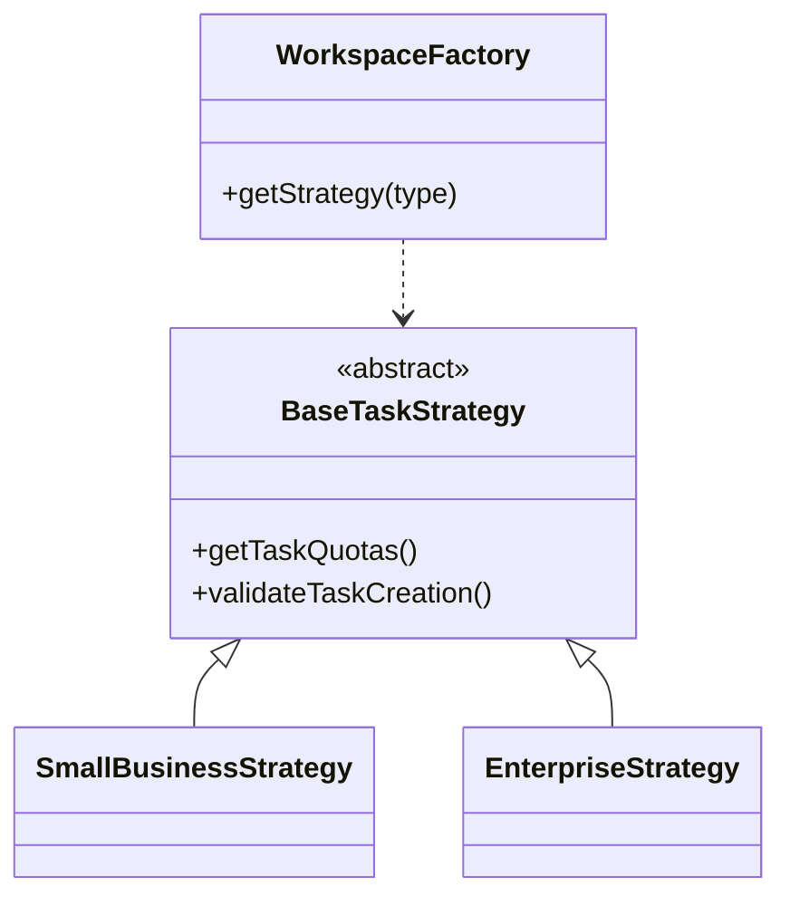

# Pomai Ecosystem: From Multi-Module Monolith to Microservices — An Architectural Evolution

Pomai Ecosystem did not begin as a distributed system, nor was it originally designed around AI Agents, event streaming, or microservices. Like many side projects that gradually evolved into larger platforms, it started with a much simpler architecture: a frontend application backed by a multi-module monolithic backend running on Firebase Firestore.

At the time, this architecture was exactly what the project needed. Every module lived inside a single repository, shared the same runtime, and communicated either through direct module imports or lightweight internal REST endpoints. Data was stored entirely inside Firestore, providing rapid development without worrying about infrastructure management.

For an early-stage product, this approach offered significant advantages. New features could be shipped quickly, every module had immediate access to shared data, deployment remained simple, and development velocity was extremely high.

However, as Pomai continued to grow, the very decisions that enabled rapid development slowly became architectural bottlenecks.

---

## The Multi-Module Monolith: Keeping Complexity Under Control

Although the backend was technically a monolith, it was never written as a giant collection of unrelated services. Instead, it was organized into multiple business modules that represented different domains inside the ecosystem.

This organization solved one problem while creating another.

Each module required its own business rules, validation logic, permissions, and workspace configuration. Yet many of these modules still shared a large amount of common functionality. Simply duplicating logic would violate DRY principles, while centralizing everything into large conditional statements would inevitably create tightly coupled code that became increasingly difficult to maintain.

One of the earliest architectural problems was supporting multiple workspace types.

Different workspace plans behaved differently.

* Small businesses had different quotas.
* Enterprise customers required additional validation rules.
* Future workspace types needed to be added without modifying existing logic.

Hardcoding these differences inside controllers would have quickly turned the codebase into an unmaintainable collection of nested `if/else` statements.

Instead, I designed a Strategy + Factory architecture around a shared abstraction.

The system defines a common `BaseTaskStrategy` that represents the contract every workspace implementation must follow. Individual strategies encapsulate their own business rules, while a centralized `WorkspaceFactory` determines which implementation should be instantiated at runtime.

This design provided several important benefits.

* Business logic remained isolated.
* New workspace types could be introduced without touching existing implementations.
* Controllers stayed clean.
* Shared functionality remained centralized.

Looking back, this abstraction became one of the foundations that later made the migration toward microservices significantly easier. Domain boundaries already existed inside the monolith long before services were physically separated.

---

## When the Monolith Started Breaking Down

The architectural limitations did not appear overnight.

The first signs were not technical—they were operational.

As more products were introduced into the Pomai Ecosystem, the amount of data stored inside Firestore increased dramatically. Every new feature generated additional document reads, writes, listeners, and nested queries.

Initially this wasn't a concern.

Firestore provided excellent developer experience.

No infrastructure management.

Automatic scaling.

Simple SDK.

Minimal operational overhead.

But eventually the pricing model became impossible to ignore.

Unlike a relational database where compute and storage are relatively predictable, Firestore charges based on document operations.

Every feature introduced additional reads.

Every dashboard refreshed multiple collections.

Every nested query multiplied the number of billable operations.

Eventually the architecture reached a point where improving the product directly increased infrastructure cost.

The system wasn't becoming slower.

It was becoming more expensive.

Quite literally, my credit card became one of the biggest architectural constraints of the project.

That was the moment I realized the problem was no longer about programming—it was about system architecture.

---

## Why PostgreSQL Instead of Staying on Firestore

Moving away from Firestore was never simply about reducing cloud bills.

As the project matured, I found myself needing capabilities that document databases were never intended to provide efficiently.

The business domain naturally evolved toward relational data.

Projects own tasks.

Tasks belong to workspaces.

Users belong to teams.

Permissions inherit through organizational hierarchies.

Reporting requires joins.

Analytics require aggregation.

Maintaining these relationships inside nested Firestore documents became increasingly difficult.

The migration to PostgreSQL provided several long-term advantages.

* Strong relational integrity.
* ACID transactions.
* Predictable query performance.
* Rich indexing capabilities.
* Lower infrastructure cost.
* Full ownership over deployment.

To avoid sacrificing development velocity, I adopted Prisma as the ORM layer.

Prisma allowed me to retain the rapid development experience I previously enjoyed with Firebase while gaining the benefits of a relational database.

The migration itself was undoubtedly the most time-consuming refactoring throughout the entire evolution of Pomai.

Every Firestore query had to be redesigned.

Nested documents needed normalization.

Batch operations became SQL transactions.

Data access patterns changed completely.

Although technically challenging, this migration established a much stronger architectural foundation for everything that followed.

---

## Why Microservices Eventually Became the Right Decision

Many projects adopt microservices simply because they are popular.

Pomai followed the opposite path.

The system remained a monolith until the architecture itself demonstrated that the monolith was becoming the bottleneck.

As more independent products were added into the ecosystem, several issues became increasingly apparent.

A single deployment contained every business domain.

Updating one module required rebuilding the entire backend.

Scaling one heavily used component meant scaling everything.

The codebase continued growing despite clear domain separation.

Infrastructure responsibilities became increasingly intertwined.

Rather than splitting services arbitrarily, I focused on identifying true business boundaries.

Domains with strong coupling remained together.

Independent domains became independent services.

Authentication.

Notifications.

Chat.

Activity logging.

AI infrastructure.

Each evolved into its own deployment unit because each had different scalability requirements and different operational concerns.

The goal was never "more services."

The goal was better separation of responsibility.

This transition also allowed each service to own its own database, removing the need for a single centralized data model while improving isolation between domains.

---

## Microservices as an Enabler, Not the Final Goal

One common misconception is that the migration ended once services were separated.

In reality, moving to microservices created entirely new architectural challenges.

Distributed communication.

Service discovery.

API routing.

Observability.

Deployment automation.

Event streaming.

Failure recovery.

These challenges eventually led to introducing Kafka, Kong Gateway, Docker, Portainer, Prometheus, Grafana, Jenkins, Gitea, and finally an AI-powered RAG logging pipeline capable of performing semantic root cause analysis entirely on CPU using llama.cpp.

Ironically, none of these technologies would have made sense inside the original monolith.

The migration to microservices was what enabled the ecosystem to evolve into a platform capable of supporting real-time communication, distributed services, AI infrastructure, and production-grade observability.

---

## Looking Back

If I were building Pomai again today, I would still begin with a monolith.

Starting with microservices from day one would have introduced unnecessary operational complexity long before the product itself justified it.

The monolith allowed rapid experimentation.

The multi-module architecture established clean domain boundaries.

Those boundaries naturally evolved into independent services when the business requirements demanded it.

For me, microservices were never the objective.

They were simply the consequence of solving increasingly larger architectural problems.

Pomai's evolution reflects a principle I now strongly believe in:

> Good architecture is not about choosing the most advanced technology. It is about allowing the architecture to evolve naturally as the complexity of the product evolves.
