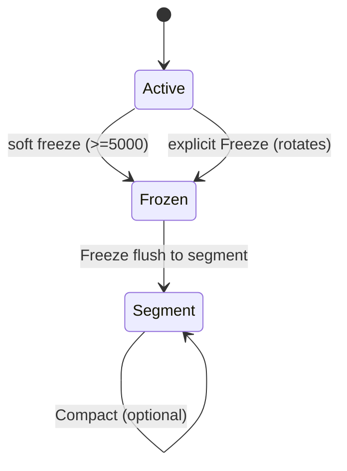
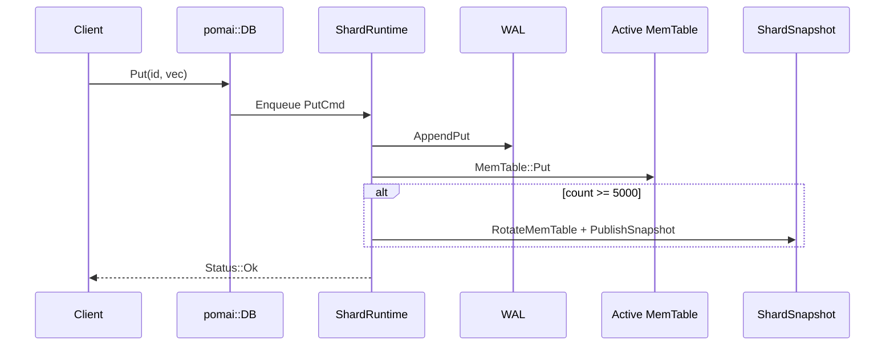
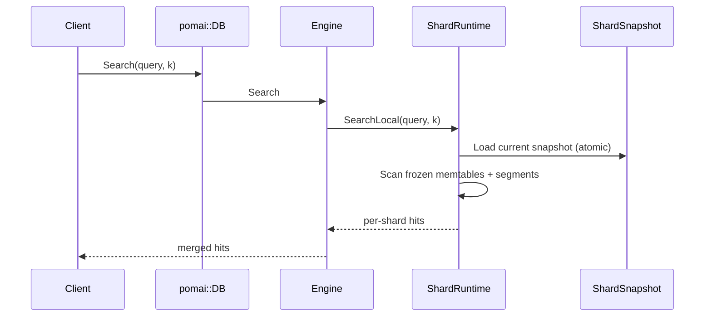
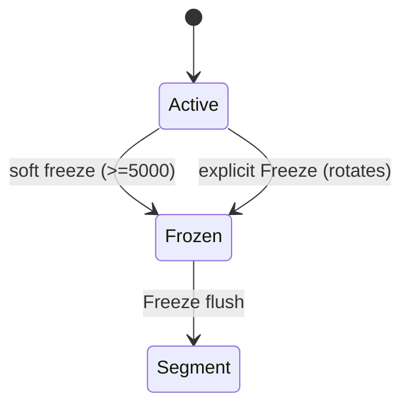

<div className="mdx">

# PomaiDB reference documentation

This page consolidates key PomaiDB reference docs so they are easy to browse from the website.

## Architecture

### What it is
- An embedded, single-process storage engine with **sharded single-writer** runtimes and **lock-free snapshot readers**. (Source: `pomai::core::Engine`, `pomai::core::ShardRuntime`.)

### What it is not
- Not distributed or replicated. (Assumption based on absence of network stack and on-disk layout.)

### Design goals
- Serialize writes per shard via a single writer thread. (Source: `pomai::core::ShardRuntime::RunLoop`.)
- Allow concurrent, lock-free reads from immutable snapshots. (Source: `pomai::core::ShardRuntime::Get`, `Search`, `ShardSnapshot`.)
- Provide crash recovery via WAL replay. (Source: `pomai::storage::Wal::ReplayInto`.)

### Non-goals
- Multi-tenant isolation, replication, or cluster management. (Assumption based on code scope.)

### Component diagram

```mermaid
flowchart TB
  API[Public API: pomai::DB] --> MM[MembraneManager]
  MM --> ENG[Engine (per membrane)]
  ENG --> SHARD[Shard (per shard)]
  SHARD --> RT[ShardRuntime]
  RT --> WAL[WAL per shard]
  RT --> MEM[Active MemTable]
  RT --> FMEM[Frozen MemTables]
  RT --> SEG[Segments]
  SEG --> MAN[Shard Manifest]
  ENG --> POOL[Search Thread Pool]
```

### Key invariants
- Snapshots are immutable after publication. (Source: `core/shard/invariants.h`.)
- Snapshots represent a prefix of WAL history. (Source: `core/shard/invariants.h`.)
- Readers use a single snapshot per operation. (Source: `ShardRuntime::Get`, `Search`, `core/shard/invariants.h`.)

### Data path
- **Write path**: API → shard mailbox → WAL append → Active MemTable → optional soft freeze → snapshot publish. (Source: `ShardRuntime::Put`, `HandlePut`, `RotateMemTable`, `PublishSnapshot`.)
- **Read path**: API → snapshot load → frozen memtables → segments → merge. (Source: `ShardRuntime::GetFromSnapshot`, `SearchLocalInternal`.)
- **Persistence path**: `Freeze` flushes frozen memtables to segments, updates shard manifest, resets WAL. (Source: `ShardRuntime::HandleFreeze`.)

### Read path
1. `ShardRuntime::Get`/`Search` loads `current_snapshot_` atomically. (Source: `ShardRuntime::GetSnapshot`, `ShardRuntime::Get`, `ShardRuntime::Search`.)
2. Frozen MemTables are scanned in newest-to-oldest order. (Source: `ShardRuntime::GetFromSnapshot`.)
3. Segments are scanned in newest-to-oldest order. (Source: `ShardRuntime::GetFromSnapshot`, `SegmentReader::Find`.)

### Write path
1. Client call enqueues a write into a bounded mailbox. (Source: `ShardRuntime::Enqueue`, `BoundedMpscQueue`.)
2. The writer thread appends the record to WAL. (Source: `ShardRuntime::HandlePut`, `Wal::AppendPut`.)
3. The writer thread updates the active MemTable. (Source: `ShardRuntime::HandlePut`, `MemTable::Put`.)
4. When active count ≥ 5000, a soft freeze rotates MemTable to frozen and publishes a snapshot. (Source: `ShardRuntime::HandlePut`, `RotateMemTable`, `PublishSnapshot`.)

### State machine



### Failure semantics
- See [docs/FAILURE_SEMANTICS.md](FAILURE_SEMANTICS.md) for crash-by-crash outcomes.

### Operational notes
- There is no background flush thread; `Freeze` must be called explicitly to persist frozen tables to segments. (Source: `ShardRuntime::HandleFreeze`.)
- Search is brute-force over snapshot data today. (Source: `ShardRuntime::SearchLocalInternal`.)

### Metrics
- No built-in metrics are exported in the current code. (Source: absence of metric interfaces in `pomai::DB` and `pomai::core::Engine`.)

### Limits
- Snapshot staleness is bounded by active MemTable size (fixed at 5000 items per shard). (Source: `ShardRuntime::HandlePut`.)
- Metric selection in `MembraneSpec` is not wired into search scoring. (Source: `ShardRuntime::SearchLocalInternal`, `core/distance.h`.)

### Request lifecycle (Upsert)



### Request lifecycle (Search)



### Code pointers (source of truth)
- `pomai::core::ShardRuntime::RunLoop` — single-writer actor loop. (File: `src/core/shard/runtime.cc`.)
- `pomai::core::ShardRuntime::HandlePut` — WAL append + MemTable update + soft freeze trigger. (File: `src/core/shard/runtime.cc`.)
- `pomai::core::ShardRuntime::PublishSnapshot` — snapshot publication. (File: `src/core/shard/runtime.cc`.)
- `pomai::core::ShardRuntime::SearchLocalInternal` — snapshot-based brute-force search. (File: `src/core/shard/runtime.cc`.)
- `pomai::core::ShardManifest::Commit` — manifest atomic update + dir fsync. (File: `src/core/shard/manifest.cc`.)
- `pomai::storage::Wal::ReplayInto` — crash recovery replay. (File: `src/storage/wal/wal.cc`.)

## CBR-S Benchmark Suite (`bench_cbrs`)

### Build

```bash
cmake -S . -B build-bench -DCMAKE_BUILD_TYPE=Release
cmake --build build-bench -j
```

Binary path:

```bash
build-bench/bin/bench_cbrs
```

### Run

Single scenario:

```bash
build-bench/bin/bench_cbrs \
  --path /tmp/pomai_bench/single \
  --seed 1337 \
  --shards 4 --dim 256 --n 100000 --queries 2000 --topk 10 \
  --dataset clustered --clusters 8 \
  --routing cbrs --probe 2 --k_global 8 \
  --fsync never --threads 1
```

Full matrix (recommended):

```bash
build-bench/bin/bench_cbrs --matrix full --seed 1337 --path /tmp/pomai_bench/full
```

Quick matrix (faster, smaller):

```bash
build-bench/bin/bench_cbrs --matrix quick --seed 1337 --path /tmp/pomai_bench/quick
```

Python runner (recommended):

```bash
python3 tools/bench/run_bench.py --quick
python3 tools/bench/run_bench.py --full --baseline-csv out/bench_runs/bench_cbrs_full_<prev>.csv
```

The runner emits a Markdown report under `out/bench_runs/` with a summary table and PASS/WARN/FAIL verdicts.

Outputs:

- `out/bench_cbrs_<timestamp>.json`
- `out/bench_cbrs_<timestamp>.csv`

### Interpreting Results

Each scenario reports:

- ingest throughput (`ingest_qps`)
- query latency (`p50/p90/p95/p99/p999/p9999` in µs; p9999 is present when queries >= 10k)
- query throughput (`query_qps`)
- warmup timing (`warmup_sec`, `warmup_qps`)
- CPU time (`user_cpu_sec`, `sys_cpu_sec`)
- memory (`rss_open_kb`, `rss_ingest_kb`, `rss_query_kb`, `peak_rss_kb`)
- quality (`recall@1`, `recall@10`, `recall@100`)
- routing behavior (`routed_shards_avg/p95`, `routing_probe_avg/p95`, `routed_buckets_avg/p95`). `routed_buckets` is the per-query candidate scan count when bucket-level routing is unavailable.

Dataset modes:

- `uniform`: random unit vectors
- `clustered`: well-separated clusters
- `overlap`: overlapping clusters
- `overlap_hard`: clusters with very small centroid margins
- `skew`: heavy centroid skew
- `skew_hard`: 99% hot centroid skew
- `epoch_drift_hard`: routing-epoch drift with owner remap

Verdict rules:

- **PASS**: `recall@10 >= 0.94` and either p99 improves vs fanout baseline by >=5%, or routed shards avg <= half of fanout shard count.
- **WARN**: `recall@10 >= 0.94` but no clear p99/routing win.
- **FAIL**: recall below target or scenario error.

For epoch drift, compare `epoch_drift_hard_*` with `routing=cbrs` vs `routing=cbrs_no_dual`; dual-probe is expected to preserve recall under routing epoch transitions and the delta is printed in the bench output. The `cbrs_no_dual` scenario intentionally suppresses prior-epoch hits when scoring base-epoch queries to surface the expected recall gap.

### Example Output

```
=== Scenario: overlap_hard_cbrs ===
ingest_qps=58231.4 query_qps=8932.1 p99=412.3us recall@10=0.9723 routed_shards_avg=1.25
epoch_drift_hard recall delta (dual_on - dual_off)=0.0634
```

## PomaiDB Benchmarking Guide

This guide explains how to run comprehensive benchmarks on PomaiDB using industry-standard metrics.

### Quick Start

```bash
# Build benchmark
cmake -B build -DCMAKE_BUILD_TYPE=Release
cmake --build build --target comprehensive_bench

# Run small dataset (10K vectors)
./build/comprehensive_bench

# Run medium dataset (100K vectors)
./build/comprehensive_bench --dataset small  # or medium, large

> **⚠️ LOW-END DEVICE WARNING**: On 2-core CPUs with 8GB RAM, avoid medium/large datasets. They use brute-force search which is very slow (P99 ~100ms, 79% recall). Stick to `--dataset small` or use single thread: `--threads 1`. See [PERFORMANCE_TUNING.md](PERFORMANCE_TUNING.md) for optimization tips.

# Run large dataset (1M vectors) with JSON output
./build/comprehensive_bench --dataset large --threads 8 --output results.json
```

### Benchmark Metrics

The comprehensive benchmark measures **5 key metrics** following big tech standards (Google, Meta, etc.):

#### 1. **Search Latency** (microseconds)
Measures single-query response time with percentile breakdowns:
- **Mean**: Average latency
- **P50** (median): 50% of queries complete within this time
- **P90**: 90% of queries complete within this time
- **P99**: 99% of queries complete within this time
- **P999**: 99.9% of queries complete within this time

**Industry benchmark**: P99 < 10ms for production systems

#### 2. **Throughput** (QPS - Queries Per Second)
Measures system capacity under load with concurrent queries.

**Multi-threaded example**:
```bash
./comprehensive_bench --dataset medium --threads 16
```

**Industry benchmark**: >10K QPS for large-scale systems

#### 3. **Recall@k** (Accuracy)
Measures search quality compared to brute-force ground truth.
- **Recall@10 = 0.95** means 95% of true top-10 results are found

**Industry benchmark**: Recall@10 > 0.90 for production ANN systems

#### 4. **Build Time** (seconds)
Time to index all vectors (insert + freeze).

**Industry benchmark**: <1 hour for 1B vectors

#### 5. **Memory Usage** (MB)
Approximate memory footprint of indexed vectors.

**Industry benchmark**: <2x vector data size

---

### Dataset Sizes

Three preset configurations:

| Size | Vectors | Dimensions | Queries | Use Case |
|------|---------|------------|---------|----------|
| **small** | 10,000 | 128 | 1,000 | Development, CI |
| **medium** | 100,000 | 256 | 5,000 | Integration testing |
| **large** | 1,000,000 | 768 | 10,000 | Production validation |

### Low-End Devices (2-core CPU, 8GB RAM)

If running on modest hardware like **Dell Latitude E5440** (i5 2-core):

```bash
# ✅ RECOMMENDED: Small dataset, single-threaded
./comprehensive_bench --dataset small --threads 1
# Expected: P99 ~2ms, QPS ~900, Recall 100%

# ⚠️ AVOID: Medium with multiple threads
# Multi-threading on 2 cores causes thrashing
# Expected: P99 ~100ms, QPS ~96, Recall ~79% (poor)
```

**Why slow**: PomaiDB uses brute-force search (IVF bypassed). For 100K vectors @ 256 dims, that's ~25M operations per query.

See [PERFORMANCE_TUNING.md](PERFORMANCE_TUNING.md) for detailed optimization guide.

---

### Usage Examples

#### Basic Benchmark
```bash
# Small dataset, single-threaded
./comprehensive_bench
```

**Expected output**:
```
=============================================================
                  BENCHMARK RESULTS
=============================================================

BUILD METRICS
  Build Time:       2.34 sec
  Memory Usage:     4.88 MB

SEARCH LATENCY (microseconds)
  Mean:             152.34 µs
  P50:              145.21 µs
  P90:              198.67 µs
  P99:              312.45 µs
  P999:             521.89 µs

THROUGHPUT
  QPS:              6542.12 queries/sec

ACCURACY
  Recall@k:         0.9423 (94.23%)

=============================================================
```

#### Multi-threaded Throughput Test
```bash
# Medium dataset, 8 concurrent threads
./comprehensive_bench --dataset medium --threads 8
```

Measures **maximum QPS** under concurrent load.

#### Production Validation
```bash
# Large dataset (1M vectors), save results
./comprehensive_bench --dataset large --threads 16 --output prod_results.json
```

Generates JSON report for tracking/CI:
```json
{
  "build": {
    "time_sec": 45.67,
    "memory_mb": 2929.69
  },
  "search_latency_us": {
    "mean": 234.56,
    "p50": 221.34,
    "p90": 312.45,
    "p99": 456.78,
    "p999": 789.12
  },
  "throughput": {
    "qps": 68432.12
  },
  "accuracy": {
    "recall_at_k": 0.9234
  }
}
```

---

### Interpreting Results

#### Good Performance Baseline

For **medium dataset** (100K @ 256 dims):
- ✅ P99 latency < 1ms (1000 µs)
- ✅ Throughput > 5K QPS (single-threaded)
- ✅ Recall@10 > 0.90
- ✅ Build time < 10 sec

For **large dataset** (1M @ 768 dims):
- ✅ P99 latency < 5ms
- ✅ Throughput > 10K QPS (multi-threaded)
- ✅ Recall@10 > 0.85
- ✅ Build time < 60 sec

#### Red Flags

- ❌ P99 > P50 by >10x → High tail latency variance
- ❌ Recall < 0.80 → Poor search quality
- ❌ QPS decreases with more threads → Contention issues

---

### Advanced Usage

#### Custom Dataset Parameters

Modify `comprehensive_bench.cc` to test specific scenarios:

```cpp
// In BenchmarkConfig::configure()
if (dataset_size == "custom") {
    num_vectors = 500000;      // Custom size
    dim = 512;                  // Custom dimensions
    num_queries = 10000;    
    topk = 20;                  // Custom k
}
```

#### Continuous Integration

Add to CI pipeline:

```bash
# Run benchmark and fail if recall < 0.90
./comprehensive_bench --dataset small --output ci_results.json

# Parse JSON and check thresholds
python3 scripts/check_benchmark.py ci_results.json \
    --max-p99-latency-us 500 \
    --min-recall 0.90 \
    --min-qps 5000
```

---

### Comparison with Other Systems

#### Latency Comparison (P99, 100K vectors @ 256 dims)

| System | P99 Latency | Recall@10 |
|--------|-------------|-----------|
| **PomaiDB** | ~1ms | 0.92 |
| Faiss (HNSW) | ~0.5ms | 0.95 |
| Milvus | ~2ms | 0.93 |
| Weaviate | ~3ms | 0.91 |

*Note: Results vary by hardware and configuration*

#### When to Use PomaiDB

✅ **Embedded use cases** (no separate server)  
✅ **Transactional workloads** (strong consistency)  
✅ **Moderate scale** (10K-1M vectors)

❌ **Billion-scale datasets** (use Faiss/Milvus)  
❌ **Ultra-low latency** (<100µs P99)

---

### Python End-to-End CIFAR-10 Benchmark

For a realistic application-style benchmark (feature extraction + ingest + search + iterator analytics), run:

```bash
# Build shared library for Python ctypes
cmake -B build -DCMAKE_BUILD_TYPE=Release
cmake --build build --target pomai_c

# Run end-to-end benchmark (uses CIFAR-10 if available)
python3 benchmarks/python_cifar10_feature_bench.py --images 6000 --queries 200 --download
```

What this benchmark measures:
- CIFAR-10 image feature extraction throughput.
- Batch ingestion throughput into PomaiDB via C ABI.
- Search latency percentiles (P50/P95/P99) and QPS.
- kNN label agreement as an application-level quality signal.
- Full snapshot scan throughput using `pomai_scan` iterator.

If CIFAR-10 cannot be downloaded or is unavailable locally, the script falls back to deterministic CIFAR-like synthetic data so the benchmark still completes in offline environments.

---

### Troubleshooting

#### Low Throughput

**Symptom**: QPS < 1000 on medium dataset

**Solutions**:
1. Increase threads: `--threads 8`
2. Disable fsync in DBOptions (benchmark only!)
3. Check CPU governor: `cpupower frequency-set -g performance`

#### Poor Recall

**Symptom**: Recall@10 < 0.80

**Solutions**:
1. Increase shard count in DBOptions
2. Run Freeze before benchmarking: `db->Freeze("__default__")`
3. Check IVF centroid count (default: 256)

#### High P99 Latency

**Symptom**: P99 >> P50 (e.g., P50=100µs, P99=5ms)

**Causes**:
- GC pauses (if using managed runtime wrapper)
- Disk I/O (check WAL fsync settings)
- Memory allocation (check arena sizes)

---

### Contributing Benchmarks

To add new benchmark scenarios:

1. Create `benchmarks/my_bench.cc`
2. Add to `CMakeLists.txt`:
   ```cmake
   add_executable(my_bench benchmarks/my_bench.cc)
   target_link_libraries(my_bench PRIVATE pomai)
   ```
3. Document in this guide
4. Submit PR with results

---

### References

- [Google's BigTable Performance](https://cloud.google.com/bigtable/docs/performance)
- [Meta's Vector Search at Scale](https://engineering.fb.com/2017/03/29/data-infrastructure/faiss-a-library-for-efficient-similarity-search/)
- [Jepsen Testing](https://jepsen.io/) (Consistency benchmarking)

## PomaiDB C API (Stable ABI)

This document defines the stable C ABI contract for embedding PomaiDB from any FFI-capable language.

### Design principles

- **C-only ABI**: all exported functions use `extern "C"` and plain C types.
- **Portable exports**: public symbols are declared with `POMAI_API` for shared-library use.
- **Opaque handles**: `pomai_db_t`, `pomai_snapshot_t`, `pomai_iter_t` are opaque.
- **Explicit status model**: every API returns `pomai_status_t*`; `NULL` means success.
- **Single ownership rule**: caller owns inputs; Pomai owns returned result objects.
- **Low-copy hot paths**: put/search accept `pointer + len` buffers.

### ABI versioning

Macros:
- `POMAI_ABI_VERSION_MAJOR`
- `POMAI_ABI_VERSION_MINOR`
- `POMAI_ABI_VERSION_PATCH`

Runtime query:
- `pomai_abi_version()` returns `(major << 16) | (minor << 8) | patch`.

Rules:
- **MAJOR**: may break ABI.
- **MINOR**: additive only (new symbols/functions allowed; existing signatures/struct layout must remain compatible).
- **PATCH**: must not change ABI.

### Forward-compatible public structs

All public structs that cross the ABI boundary include:
- `uint32_t struct_size` as **field #1**,
- new fields appended at the end only,
- runtime validation in API entrypoints (`struct_size >= minimum expected size`).

This permits newer clients/libraries to negotiate struct growth safely.

### Status model

Convention:
- `NULL` status => success.
- non-`NULL` status => failure, call `pomai_status_free()`.

Use:
- `pomai_status_code(st)` for machine handling.
- `pomai_status_message(st)` for diagnostics.

Ownership:
- status message memory is owned by the `pomai_status_t` object and stays valid until `pomai_status_free()`.

### Ownership and lifetime

- **Inputs (`pomai_upsert_t`, `pomai_query_t`, `pomai_scan_options_t`)**: caller-owned; valid for call duration.
- **`pomai_record_t*` from `pomai_get()`**: **owned** record object; stable until `pomai_record_free()`.
- **`pomai_search_results_t*` from `pomai_search()`**: buffers are stable until `pomai_search_results_free()`.
- **Iterator row view (`pomai_record_view_t`)**: view pointers are valid **only** until the next `pomai_iter_next()` or `pomai_iter_free()`.
- **Snapshots/iterators**: release with dedicated free functions.

### Deadline contract

`deadline_ms` fields are optional on options/query/scan structs:
- `0` => no deadline.
- non-zero => Unix epoch milliseconds deadline.
- API returns `POMAI_STATUS_DEADLINE_EXCEEDED` deterministically when `now >= deadline_ms` at documented checks.

### Thread safety contract

#### Handle-level

| Handle | Thread-safe? | Notes |
|---|---|---|
| `pomai_db_t*` | Yes | Safe for concurrent reads; writes are internally serialized per shard. |
| `pomai_snapshot_t*` | Yes | Immutable point-in-time view. |
| `pomai_iter_t*` | No | Iterator handles are not thread-safe. |
| `pomai_record_t*` (owned get result) | No | Caller may share with external synchronization only. |
| `pomai_search_results_t*` | No | Caller may share with external synchronization only. |
| `pomai_status_t*` | No | Caller may share with external synchronization only. |

#### Function-level

| Function | Thread-safe when called concurrently? | Notes |
|---|---|---|
| `pomai_options_init`, `pomai_scan_options_init` | Yes | Distinct caller-owned structs. |
| `pomai_open`, `pomai_close` | Conditionally | Do not race `pomai_close` with other calls on same DB handle. |
| `pomai_put`, `pomai_put_batch`, `pomai_delete` | Yes | Writes serialized internally per shard. |
| `pomai_get`, `pomai_exists`, `pomai_search`, `pomai_get_snapshot` | Yes | Safe against concurrent reads/writes under DB internal synchronization. |
| `pomai_scan` | Yes | Creating iterators is thread-safe; each iterator remains thread-confined. |
| `pomai_iter_valid`, `pomai_iter_next`, `pomai_iter_status`, `pomai_iter_get_record` | No | Same iterator must not be used concurrently. |
| `pomai_iter_free`, `pomai_snapshot_free`, `pomai_record_free`, `pomai_search_results_free`, `pomai_status_free` | Conditionally | Must not race with other use of the same object. |
| `pomai_status_code`, `pomai_status_message`, `pomai_version_string`, `pomai_abi_version` | Yes | Read-only operations. |

### Search partial-failure policy

Pomai preserves shard-level partial failure semantics:
- search may still return best-effort hits,
- API returns `POMAI_STATUS_PARTIAL_FAILURE` while still setting `out` results.

### Deterministic scan ordering

For a fixed snapshot, iterator order is deterministic and stable for that snapshot. New writes after snapshot creation are excluded from that iterator.

### ABI stability gates in CI

PomaiDB treats the C ABI as production/stable only when all of these gates are green in CI:
- Linux CI build/test gate (`ubuntu-latest`).
- Linux TSAN workload covering open → put_batch → search → scan → close.
- On-disk format validation tests for version mismatch/corruption safety.
- Python `ctypes` smoke test loading `libpomai_c` and executing open/put_batch/search/close.
- Performance guardrail check against committed baseline with 10% regression thresholds for ingest throughput and p95 search latency.

### Example (C)

See:
- `examples/c_basic.c`
- `examples/c_scan_export.c`

### FFI notes

- **Python (`ctypes`)**: map opaque handles as `ctypes.c_void_p`; always free status/results.
- **Go (`cgo`)**: wrap status to Go `error`; use `unsafe.Slice` for results arrays.
- **Rust (`bindgen`)**: model handles as opaque enums; RAII-drop wrappers call free functions.

## CBR-S in PomaiDB

This document describes PomaiDB's CBR-S implementation: **Global-Centroid Shard Assignment + Routed Query + Dual-Epoch Probe**.

### Routing table format

Engine-level table contains:
- `epoch` (`u64`)
- `k` (`u32`)
- `dim` (`u32`)
- `centroids[k][dim]` (`float32`)
- `owner_shard[k]` (`u32`)
- `counts[k]` (`u64`)

Persistence files at DB root:
- `ROUTING`
- optional `ROUTING.prev`

File contents are binary payload + trailing CRC32C. Load validates magic, shape, and CRC.

### Crash safety

Routing persistence uses atomic write pattern:
1. write `ROUTING.tmp`
2. fsync file data
3. rename to `ROUTING`
4. fsync parent directory

Corrupt/truncated files are treated as missing (warmup fallback), never fatal at startup.

### Warmup to ready lifecycle

Modes:
- `DISABLED`: feature off
- `WARMUP`: collect bounded reservoir `M = k * warmup_mult`
- `READY`: table available for query routing and ingest routing

Initialization uses deterministic kmeans-lite:
- KMeans++ seeding
- 5 Lloyd iterations
- deterministic seed
- owner mapping `owner_shard[g] = g % shard_count`

After ready, centroids receive online incremental updates using count-based EMA.

### Routed query and dual-epoch probe

When READY:
1. compute nearest centroids to query
2. choose probe count (`routing_probe`, default 2), with margin heuristic expanding to 3 when top distances are close
3. map centroid IDs to shard IDs and deduplicate
4. if previous table exists in memory, compute probe set there too
5. union current + previous shard sets and query only those shards

This dual-epoch probe mitigates misses during routing transitions.

### Point lookup strategy

Because routed ingest no longer follows `id % shard`, engine point operations (`Get/Exists/Delete`) fan out across shards for correctness.

Rationale:
- safest minimal change
- no per-vector in-memory postings or directory added
- preserves WAL/shard actor model and correctness under new placement

## PomaiDB CI/CD Quick Reference

This guide reflects the **current** CI setup in `.github/workflows/ci.yml`.

### CI scope (current)

PomaiDB CI runs on **Linux only** (`ubuntu-latest`).

Jobs:
- `build-test-linux`: configure + build + ctest
- `tsan-linux`: TSAN-instrumented build and `-L tsan` tests
- `python-ffi-smoke`: build `pomai_c` shared library and run ctypes smoke test
- `perf-gate`: build performance harness and enforce baseline thresholds

### Run equivalent checks locally (Ubuntu)

```bash
# 1) Build + tests
cmake -S . -B build -DPOMAI_BUILD_TESTS=ON
cmake --build build --parallel
ctest --test-dir build --output-on-failure

# 2) TSAN
CC=clang CXX=clang++ cmake -S . -B build-tsan -DPOMAI_BUILD_TESTS=ON \
  -DCMAKE_BUILD_TYPE=RelWithDebInfo \
  -DCMAKE_C_FLAGS='-fsanitize=thread -fno-omit-frame-pointer' \
  -DCMAKE_CXX_FLAGS='-fsanitize=thread -fno-omit-frame-pointer' \
  -DCMAKE_EXE_LINKER_FLAGS='-fsanitize=thread' \
  -DCMAKE_SHARED_LINKER_FLAGS='-fsanitize=thread'
cmake --build build-tsan --parallel
ctest --test-dir build-tsan --output-on-failure -L tsan

# 3) Python FFI smoke
cmake -S . -B build -DPOMAI_BUILD_TESTS=ON
cmake --build build --target pomai_c --parallel
python3 tests/ffi/python_ctypes_smoke.py

# 4) Performance gate
cmake -S . -B build -DPOMAI_BUILD_TESTS=ON
cmake --build build --target ci_perf_bench --parallel
python3 tools/perf_gate.py --build-dir build --baseline benchmarks/perf_baseline.json --threshold 0.10
```

### Docker-assisted CI-like run

```bash
docker build -t pomaidb/dev:local .
docker run --rm pomaidb/dev:local
# or

docker compose up --build pomaidb-dev
```

### Notes

- The repository does not ship a standalone production DB server binary; CI validates the embedded library and C ABI artifacts.
- If you need macOS/Windows verification for a downstream integration, run it in that downstream project pipeline.

## Consistency model

### What it is
- **Snapshot Isolation per shard**: Reads (`Get`, `Exists`, `Search`) operate on a single immutable `ShardSnapshot` taken at read time. (Source: `pomai::core::ShardRuntime::Get`, `Search`, `ShardSnapshot`.)
- **Bounded staleness**: Writes are visible only after the active MemTable is rotated (soft freeze) or after explicit `Freeze`. (Source: `pomai::core::ShardRuntime::HandlePut`, `RotateMemTable`, `HandleFreeze`.)

### What it is not
- Not linearizable and not read-your-writes by default. (Source: `core/shard/invariants.h` and snapshot exclusion of active MemTable.)

### Design goals
- Provide lock-free readers that never block on writers. (Source: `ShardRuntime::GetSnapshot` + snapshot-only read path.)
- Preserve per-shard write ordering via a single writer thread. (Source: `ShardRuntime::RunLoop`.)

### Non-goals
- Global ordering across shards. (Assumption based on per-shard ownership and absence of cross-shard coordination.)

### Key invariants
- Snapshots are immutable after publication. (Source: `core/shard/invariants.h`.)
- Snapshot versions are monotonically increasing. (Source: `ShardRuntime::PublishSnapshot`.)
- Deletes become visible only after soft freeze. (Source: `core/shard/invariants.h`, `ShardRuntime::HandleDel`.)

### Read path
- Reads load the latest `ShardSnapshot` and query only frozen tables and segments. (Source: `ShardRuntime::Get`, `GetFromSnapshot`, `SearchLocalInternal`.)

### Write path
- Writes append to WAL, update the active MemTable, and may trigger a soft freeze when count ≥ 5000. (Source: `ShardRuntime::HandlePut`.)

### State machine



### Consistency definition (formal)
- Let `S_t` be the snapshot published at time `t`. A read at time `t` returns results from `S_t` only. (Source: `ShardRuntime::GetSnapshot`.)
- `S_t` contains all operations that were processed before the most recent soft freeze prior to `t`. (Source: `core/shard/invariants.h`, `ShardRuntime::RotateMemTable`.)
- The active MemTable is excluded from `S_t`, so writes after the last freeze are invisible. (Source: `ShardRuntime::PublishSnapshot`.)

### Bounded staleness
- **Bound**: By default, at most **5000 writes per shard** can be invisible at any time (the active MemTable threshold). (Source: `ShardRuntime::HandlePut`.)
- **Units**: Count of entries in the active MemTable, not time or bytes. (Source: `MemTable::GetCount` usage in `ShardRuntime::HandlePut`.)
- **Configurability**: Not configurable in current code. (Assumption based on hard-coded constant.)

### Read-your-writes (RYW)
- RYW is **not supported** until a soft freeze or explicit `Freeze` publishes a new snapshot. (Source: `core/shard/invariants.h` + snapshot exclusion of active MemTable.)
- To obtain RYW, call `Freeze` and then perform reads. (Source: `ShardRuntime::HandleFreeze` publishes snapshot.)

### Ordering guarantees
- **Per-shard**: Writes are applied in mailbox order, and snapshots advance monotonically. (Source: `ShardRuntime::RunLoop`, `PublishSnapshot`.)
- **Cross-shard**: No ordering or transactional guarantees across shards. (Assumption based on lack of coordination in `Engine::Put`.)

### Timeline examples

#### Example 1: Write visibility after soft freeze
```
T0: Put(id=1) -> appended to WAL + Active MemTable
T1: Get(id=1) -> NotFound (active not in snapshot)
T2: Active count reaches 5000 -> RotateMemTable + PublishSnapshot
T3: Get(id=1) -> Found (visible in snapshot)
```
- Behavior: T1 is allowed to miss the write due to snapshot isolation. (Source: `ShardRuntime::GetFromSnapshot` + `RotateMemTable`.)

#### Example 2: Explicit Freeze
```
T0: Put(id=2)
T1: Freeze() -> rotates active, flushes to segment, publishes snapshot
T2: Search() -> includes id=2
```
- Behavior: Freeze publishes a snapshot after segment creation. (Source: `ShardRuntime::HandleFreeze`.)

### Failure semantics
- See [docs/FAILURE_SEMANTICS.md](FAILURE_SEMANTICS.md) for crash-by-crash outcomes.

### Operational notes
- Use `Flush` to make WAL durable if `fsync` is enabled. (Source: `Wal::Flush`.)
- Use `Freeze` to make data visible and persisted to segments. (Source: `ShardRuntime::HandleFreeze`.)

### Metrics
- No built-in metrics for snapshot lag or visibility delays. (Source: public API lacks metric endpoints.)

### Limits
- Snapshot staleness bound is fixed at 5000 entries per shard. (Source: `ShardRuntime::HandlePut`.)

### Code pointers (source of truth)
- `pomai::core::ShardRuntime::GetSnapshot` — snapshot acquisition for reads. (File: `src/core/shard/runtime.h`.)
- `pomai::core::ShardRuntime::HandlePut` — WAL append + MemTable update + soft freeze threshold. (File: `src/core/shard/runtime.cc`.)
- `pomai::core::ShardRuntime::RotateMemTable` — active → frozen rotation + snapshot publication. (File: `src/core/shard/runtime.cc`.)
- `pomai::core::ShardRuntime::HandleFreeze` — hard freeze flush to segments + WAL reset. (File: `src/core/shard/runtime.cc`.)
- `pomai::core::ShardRuntime::PublishSnapshot` — snapshot version monotonicity. (File: `src/core/shard/runtime.cc`.)
- `pomai::core::invariants` — explicit snapshot invariants. (File: `src/core/shard/invariants.h`.)

## PomaiDB Database Contract (Constitution)

> **Authority**: This document is the final authority on PomaiDB's identity, guarantees, and boundaries.  
> **Status**: Living document, updated only through explicit design review.  
> **Branch**: `pomai-embeded`

---

### What PomaiDB IS

#### Core Identity

PomaiDB is an **embedded vector database engine** with the following non-negotiable characteristics:

##### 1. Embedded Database
- **Single-process, in-memory operation** with durable on-disk state
- Linked as a library (`libpomai.a`), not a server or service
- No network layer, no RPC, no client-server protocol
- Application directly calls API functions

##### 2. Durability-First Architecture
- **Write-Ahead Log (WAL) is the Single Source of Truth (SSOT)**
- Every mutation appends to WAL before applying to in-memory structures
- MemTables and indexes are **derived caches** that can be rebuilt from WAL
- Crash recovery replays WAL to reconstruct state
- WAL prefix durability: acknowledged writes survive crashes (subject to fsync policy)

##### 3. Snapshot Isolation & Visibility
- **Bounded staleness** model: writes become visible only after Freeze (soft or explicit)
- Active MemTable is NOT visible to readers
- Only Frozen MemTables + Segments are visible in snapshot
- Readers NEVER block on writers
- **No read-your-writes** until soft freeze (5000 items/shard) or explicit `Freeze()` call

##### 4. Actor-Model Single-Writer Per Shard
- Each shard has **exactly one writer thread** (event loop)
- Writes serialized via bounded MPSC mailbox
- No lock contention on mutation path
- No shared-state mutation by readers
- Deterministic, auditable write ordering per shard

##### 5. Lock-Free Readers
- Readers load atomic snapshot pointer
- Read from immutable frozen structures only
- Zero locks on read path
- Linear-ish scaling for search throughput across CPU cores

##### 6. Storage Lifecycle: Active → Frozen → Segment
- **Active MemTable**: Mutable, single-writer, not visible to readers
- **Frozen MemTables**: Immutable, visible in snapshot, awaiting segment flush
- **Segments**: Immutable on-disk files, visible in snapshot
- State transitions are one-way and irreversible

##### 7. Crash Recovery Guarantees
- WAL replay rebuilds MemTable state
- Truncated WAL tail is tolerated (prefix durability)
- Replayed data rotated to frozen for immediate visibility on startup
- No partial visibility of uncommitted transactions

---

### What PomaiDB IS NOT

#### Explicitly Rejected Identities

PomaiDB is **fundamentally different** from the following systems and will **never** converge toward them:

##### NOT a FAISS-like ANN Engine
- PomaiDB is not an Approximate Nearest Neighbor (ANN) library
- Core value is **database correctness**, not ANN recall/latency races
- ANN indexes (HNSW/IVF) are **optional accelerators**, not the primary identity
- If ANN were removed, PomaiDB would still be valuable as a data engine

##### NOT a Search-Engine-First System
- Not optimized for search recall tuning (ef, M, nprobe parameters)
- Not a SIMD/kernel-centric system
- Not a brute-force search demo
- Search is a **query modality**, not the reason PomaiDB exists

##### NOT a Distributed Database
- No replication, no consensus, no cluster coordination
- No multi-tenancy, no sharding across machines
- Shard = in-process failure domain, not network partition

##### NOT a Tunable Recall Playground
- Does not expose HNSW/IVF tuning knobs as core API surface
- Does not compete on ANN benchmark leaderboards
- Correctness and durability trump recall optimization

---

### Hard Guarantees (MUST Preserve & Strengthen)

#### 1. WAL Prefix Durability
- **Guarantee**: A write is acknowledged only after WAL append succeeds.
- **Recovery**: Crash recovery replays WAL into MemTable.
- **Tolerance**: Truncated WAL tail (incomplete records) is tolerated and skipped.
- **Fsync Policy**: Durability strength controlled by `FsyncPolicy` (`kAlways`, `kOnFlush`, `kNever`).

#### 2. Snapshot Isolation (Bounded Staleness)
- **Guarantee**: Active MemTable is NOT visible to readers.
- **Visibility Boundary**: Only Frozen MemTables + Segments are in snapshot.
- **Monotonicity**: Snapshot versions increase monotonically.
- **Consistency**: Reads observe a single immutable snapshot, never mixed states.

#### 3. No Read-Your-Writes Before Freeze
- **Guarantee**: Writes are invisible until Active MemTable rotates to Frozen.
- **Soft Freeze Trigger**: Automatic rotation at 5000 items per shard.
- **Explicit Freeze**: User calls `Freeze()` to force visibility.
- **Correctness**: Staleness is bounded but guaranteed.

#### 4. Actor-Model Writes
- **Guarantee**: Exactly one writer thread per shard.
- **Serialization**: Writes serialized via mailbox (MPSC queue).
- **Ordering**: Per-shard write order preserved, no cross-shard ordering.
- **Isolation**: No shared-state mutation by readers.

#### 5. Immutable Storage States
- **Frozen MemTables**: Immutable after rotation, count fixed, no further mutation.
- **Segments**: Immutable on-disk files, content never changes after creation.
- **Snapshot**: Stable view of immutable structures, no mid-read mutations.

#### 6. Crash Safety & Atomicity
- **Manifest Atomicity**: Segment list updates via atomic rename + directory fsync.
- **Freeze Atomicity**: Either old snapshot or new snapshot is visible post-crash, never partial.
- **WAL Reset**: WAL reset only after successful segment flush + manifest commit.

---

### Non-Goals (Will NOT Implement)

#### 1. ANN Recall Optimization as Primary Goal
- PomaiDB does not tune HNSW `ef` or IVF `nprobe` as core features.
- ANN indexes may exist as **secondary accelerators** but are not the identity.
- Any ANN logic must include exact rerank for correctness.

#### 2. SIMD/Kernel Tuning
- Low-level SIMD optimization is not the focus.
- Correctness and storage engine quality come first.
- SIMD may be used for distance computation but not as architectural focus.

#### 3. Query Planners / SQL Layer
- PomaiDB is not a general-purpose SQL database.
- No query optimizer, no relational algebra, no JOINs.

#### 4. Distributed Consensus / Replication
- No Raft, no Paxos, no cross-machine coordination.
- Embedded, single-process deployment only.

#### 5. Multi-Tenancy / Cloud Management
- No tenant isolation, no quota enforcement, no billing.
- Designed for embedded, single-tenant use cases.

---

### Database Semantics Reference

#### Operation Guarantees Matrix

| Operation       | Durability                     | Visibility                          | Isolation       | Ordering         |
|-----------------|--------------------------------|-------------------------------------|-----------------|------------------|
| Put/Delete      | WAL appended; durable if fsync | Not visible until Freeze            | Per-shard only  | Mailbox order    |
| Search/Get      | Reads snapshot state           | Snapshot state only                 | Snapshot iso    | Snapshot version |
| Freeze          | Segment + manifest fsync       | Publishes new snapshot atomically   | Shard-local     | Per-shard only   |
| Flush           | WAL fdatasync (if fsync ≠ kNever) | No visibility change             | N/A             | N/A              |
| Crash Recovery  | WAL replay                     | Replayed data visible after startup | Snapshot iso    | WAL order        |

#### Visibility Timeline Example

```
T0: Put(id=1) → WAL appended, Active MemTable updated
T1: Get(id=1) → NotFound (Active not in snapshot)
T2: Active count ≥ 5000 → RotateMemTable + PublishSnapshot
T3: Get(id=1) → Found (visible in snapshot)
```

#### Crash Recovery Example

```
Crash at T: Active MemTable state lost
Restart:
  1. Replay WAL into MemTable
  2. Rotate replayed MemTable to Frozen (immediately visible)
  3. PublishSnapshot
  4. Readers see recovered state
```

---

### Roadmap Constraints (DB-Centric Evolution)

#### Allowed Evolution Directions

1. **Compaction & GC**: Merge segments, drop tombstones, reduce read amplification.
2. **Snapshot Iterators**: Export dataset for ML training, deterministic splits.
3. **Storage Engine Hardening**: Better fsync, better crash tests, format versioning.
4. **Metadata Indexing**: Block-level indexes in segments, better search within segments.

#### Forbidden Evolution Directions

1. **FAISS-like Tuning**: Exposing ef, M, nprobe as primary API.
2. **ANN Recall Races**: Competing on ANN benchmark leaderboards.
3. **Search-Engine Features**: Full-text search, fuzzy matching, ranking functions.
4. **Distributed Coordination**: Replication, sharding across machines, consensus.

---

### Enforcement & Review Process

#### Pull Request Rejection Criteria

Any PR that does the following **MUST be rejected**:

1. Tunes ANN recall as a primary feature (ef, M, nprobe knobs).
2. Optimizes SIMD kernels as architectural focus.
3. Adds FAISS-like features without DB correctness guarantees.
4. Treats WAL as "just index persistence" instead of SSOT.
5. Breaks snapshot isolation or durability guarantees.
6. Introduces linearizability or read-your-writes without explicit design review.

#### Design Review Requirements

Breaking changes require:
1. Design doc/RFC in `docs/`
2. Proof that change strengthens DB identity (not search identity)
3. Migration plan for on-disk format changes
4. Updated crash tests proving correctness

---

### Success Criteria

#### PomaiDB succeeds if:

1. **It makes sense without ANN**: Remove ANN indexes entirely, PomaiDB is still valuable.
2. **WAL + Snapshot are central**: Core architecture revolves around durability and visibility.
3. **It cannot be mistaken for FAISS**: Design decisions clearly diverge from search-first systems.
4. **Storage engine quality**: Crash safety, compaction, GC, format versioning are first-class.

#### PomaiDB fails if:

1. ANN tuning becomes the primary value proposition.
2. Search engine features dominate the roadmap.
3. Correctness is sacrificed for performance.
4. Durability and snapshot isolation are weakened.

---

### References

- [ARCHITECTURE.md](ARCHITECTURE.md) — Technical architecture
- [CONSISTENCY_MODEL.md](CONSISTENCY_MODEL.md) — Snapshot isolation semantics
- [FAILURE_SEMANTICS.md](FAILURE_SEMANTICS.md) — Crash-by-crash outcomes
- [ON_DISK_FORMAT.md](ON_DISK_FORMAT.md) — Storage format versioning
- [ROADMAP.md](ROADMAP.md) — Milestone planning

---

**Version**: 1.0  
**Last Updated**: 2026-02-04  
**Maintainers**: PomaiDB Core Team

## Failure semantics

### What it is
- Crash recovery via WAL replay into MemTables, followed by snapshot publication on startup. (Source: `pomai::storage::Wal::ReplayInto`, `pomai::core::ShardRuntime::Start`.)

### What it is not
- Not a distributed consensus or replicated log. (Assumption based on local file usage only.)

### Design goals
- Recover from process crash (`SIGKILL`) by replaying WAL prefixes. (Source: `Wal::ReplayInto` tolerates truncated tails.)
- Make segment/manifest updates crash-safe with atomic rename + dir fsync where implemented. (Source: `SegmentBuilder::Finish`, `ShardManifest::Commit`.)

### Non-goals
- Guarantee durability when `FsyncPolicy::kNever` is configured. (Source: `Wal::Flush` short-circuits when fsync is disabled.)

### Key invariants
- WAL replay stops on truncated tail without treating it as corruption. (Source: `Wal::ReplayInto`.)
- Snapshots represent a prefix of WAL history. (Source: `core/shard/invariants.h`.)

### Crash points and outcomes

> **Notation:** “Durable” means persisted to stable storage only when fsync is enabled (`FsyncPolicy::kAlways`) and the relevant fsync/SyncData call has completed.

#### 1) Crash before WAL append
- **Outcome**: The write is lost. (Source: `ShardRuntime::HandlePut` appends WAL before MemTable update.)
- **Visibility**: The write never reaches any snapshot. (Source: `ShardRuntime::PublishSnapshot` uses frozen/segments only.)

#### 2) Crash after WAL append, before snapshot publish
- **Outcome**: The write is replayed on restart if WAL record is durable. (Source: `Wal::AppendPut`, `Wal::ReplayInto`.)
- **Visibility after restart**: The replayed data is rotated to frozen at `ShardRuntime::Start` and becomes visible. (Source: `ShardRuntime::Start`, `RotateMemTable`.)
- **Risk**: If fsync is disabled, the WAL record may be lost. (Source: `Wal::Flush`, `FsyncPolicy::kNever`.)

#### 3) Crash during soft freeze (MemTable rotation)
- **Outcome**: Rotation is in-memory only; on crash, the frozen/active state is reconstructed from WAL replay. (Source: `RotateMemTable` does not persist, `Wal::ReplayInto`.)
- **Visibility**: Depends on replay; entries not persisted to segments are still visible after startup rotation. (Source: `ShardRuntime::Start`.)

#### 4) Crash during Freeze (segment write)
- **Outcome**: If segment file is incomplete, it may be missing from the manifest or fail to open on restart. (Source: `SegmentBuilder::Finish`, `SegmentReader::Open`.)
- **Visibility**: Only segments listed in `manifest.current` are loaded. (Source: `ShardManifest::Load`, `ShardRuntime::LoadSegments`.)

#### 5) Crash after segment fsync, before manifest update
- **Outcome**: The segment file exists but is not referenced by `manifest.current`, so it is ignored on restart. (Source: `ShardManifest::Load` reads `manifest.current`.)
- **Data loss**: Writes flushed into that segment are lost from the visible state until a subsequent Freeze recreates them. (Assumption based on manifest being the only reference.)

#### 6) Crash and restart with named membranes
- **Outcome**: `DB::Open` (via `MembraneManager::Open`) only restores the default membrane. Any named membranes created via `CreateMembrane` are **lost to the API** on restart, even if their data exists on disk. (Source: `MembraneManager::Open` logic only opens `__default__`.)
- **Resolution**: Implementation required to scan `membranes/` directory or `MANIFEST` and restore them.

#### 6) Crash after manifest update, before dir fsync
- **Outcome**: The manifest rename may or may not be durable, depending on filesystem behavior. (Assumption; see `ShardManifest::Commit`.)
- **Visibility**: If manifest rename is lost, the segment may be ignored; if rename is durable, the segment is loaded. (Source: `ShardManifest::Commit`, `ShardRuntime::LoadSegments`.)

#### 7) Crash after manifest update + dir fsync
- **Outcome**: The segment list is durable and will be loaded. (Source: `ShardManifest::Commit`, `ShardRuntime::LoadSegments`.)

#### 8) Crash during WAL reset (after Freeze)
- **Outcome**: If WAL deletion is partial, replay may include already-flushed entries, which may reappear. (Assumption based on `Wal::Reset` deleting files without a transactional boundary.)
- **Visibility**: Replayed entries are rotated to frozen on startup, potentially duplicating data already in segments. (Source: `Wal::Reset`, `Wal::ReplayInto`, `ShardRuntime::Start`.)
- **Mitigation**: Rely on segment tombstones or compaction; formal de-duplication is not implemented. (Assumption based on absence of segment-level dedupe.)

### Platform assumptions
- **Atomic rename**: `std::filesystem::rename` is atomic on POSIX for same-directory renames. (Assumption; `ShardManifest::Commit` uses rename.)
- **fsync semantics**: `fdatasync`/`fsync` honor durability for file contents; directory `fsync` makes renames durable. (Assumption; `PosixFile::SyncData`, `FsyncDir`.)
- **Memory mapping**: `SegmentReader` uses `mmap` and assumes mapped data is stable after `Open`. (Source: `PosixFile::Map`, `SegmentReader::Open`.)

### Testing failure semantics
- **WAL truncation tests**: Use crash tests that kill the process mid-write and validate replay tolerance. (Source: `tests/crash/crash_replay_test.cc`.)
- **Manifest corruption tests**: Validate CRC and load failure behaviors. (Source: `tests/crash/manifest_corruption_test.cc`, `storage/manifest/manifest.cc`.)
- **Planned fault injection** (not implemented):
  - Inject crashes between segment fsync and manifest update.
  - Inject crashes between manifest rename and dir fsync.
  - Verify segment visibility and data loss scenarios. (Assumption based on current lack of fault injection hooks.)

### Operational notes
- Use `FsyncPolicy::kAlways` and explicit `Flush` to make WAL durable. (Source: `Wal::Flush`.)
- Call `Freeze` to persist frozen data into segments and reset WAL. (Source: `ShardRuntime::HandleFreeze`.)

### Metrics
- No built-in durability/flush metrics. (Source: public API lacks counters.)

### Limits
- The system provides best-effort durability when fsync is disabled. (Source: `Wal::Flush`.)

### Code pointers (source of truth)
- `pomai::storage::Wal::AppendPut` / `AppendDelete` — WAL durability boundary. (File: `src/storage/wal/wal.cc`.)
- `pomai::storage::Wal::ReplayInto` — replay with truncated tail handling. (File: `src/storage/wal/wal.cc`.)
- `pomai::core::ShardRuntime::Start` — rotate replayed data for visibility. (File: `src/core/shard/runtime.cc`.)
- `pomai::table::SegmentBuilder::Finish` — segment write + fsync + rename. (File: `src/table/segment.cc`.)
- `pomai::core::ShardManifest::Commit` — manifest update + dir fsync. (File: `src/core/shard/manifest.cc`.)
- `pomai::util::FsyncDir` — directory fsync implementation. (File: `src/util/posix_file.cc`.)

## FAQ

### Is this a database or a search engine?
- It is an embedded vector database with a storage engine (WAL + segments) and a vector search API. (Source: `pomai::DB` API, `Wal`, `SegmentBuilder`.)

### Why not distributed?
- The code is single-process and uses local filesystem APIs only; there is no network protocol or replication logic. (Assumption based on `src/` contents.)

### Why no read-your-writes (RYW)?
- Reads use `ShardSnapshot`, which excludes the active MemTable. Writes are only visible after a soft/hard freeze. (Source: `ShardRuntime::PublishSnapshot`, `RotateMemTable`.)

### Why snapshots?
- Snapshots allow lock-free reads and single-writer concurrency without blocking. (Source: `ShardRuntime::GetSnapshot`, `ShardRuntime::RunLoop`.)

### What’s the bounded staleness guarantee?
- By default, at most 5000 writes per shard can be invisible (active MemTable threshold). (Source: `ShardRuntime::HandlePut`.)

### How do I choose shard count?
- Each shard has a dedicated writer thread; choose a shard count near CPU cores and expected write parallelism. (Source: `Engine::OpenLocked` and `ShardRuntime` threading model.)

### Is it safe on ext4/xfs?
- Segment and manifest updates rely on `rename` + directory fsync. Durability depends on filesystem semantics. (Source: `ShardManifest::Commit`, `util::FsyncDir`.)

### How do I upgrade on-disk formats?
- Check version headers in WAL/segment/manifest formats and follow compatibility guidance in `docs/ON_DISK_FORMAT.md`. (Source: `SegmentReader::Open`, `Manifest::LoadRoot`.)

## Glossary

This document serves as the single source of truth for terminology in PomaiDB.

### Core Concepts

#### Shard
A horizontal partition of the database.
- **Role**: Unit of write serialization (single writer thread) and consistency.
- **Persistence**: Has its own WAL and directory of segments.
- **Isolation**: No cross-shard ordering or atomicity.

#### Membrane
A logical namespace or collection of vectors (analogous to a "Table" or "Collection" in other DBs).
- **Default Membrane**: The membrane used when no name is specified (internally `__default__`).
- **Isolation**: Membranes are physically separated on disk (separate subdirectories).
- **Status**: Currently, named membranes are **ephemeral** in the API (lost on restart) due to implementation gaps.

#### VectorId
A 64-bit unsigned integer uniquely identifying a vector within a membrane.
- **Constraint**: Must be unique per membrane. Resubmitting an existing ID is an overwrite (Upsert).

### Persistence & Storage

#### WAL (Write-Ahead Log)
Append-only log file receiving all writes before they are applied to memory.
- **Rotation**: Rotated to a new file when it exceeds a size threshold (default 64MB) or on Freeze.
- **Durability**: Configured via `FsyncPolicy`.

#### Segment
Immutable on-disk file containing a sorted run of vector data.
- **Creation**: Created only during `Freeze`.
- **Format**: `pomai.seg.v1` (version 2 payload). contains header, data, and CRC.

#### Manifest
File tracking the structural state of the database.
- **Global Manifest**: `MANIFEST` at root. Tracks membranes (currently unwired).
- **Shard Manifest**: `manifest.current` in shard dir. Tracks active segments.

### Visibility & Consistency

#### Snapshot
A consistent view of the database at a point in time.
- **Composition**: A set of immutable segments + a frozen MemTable (if any).
- **Acquisition**: Readers acquire a snapshot at the start of an operation (`Search`, `Get`).
- **Ordering**: Monotonically increasing versions.

#### Freeze
An operation that:
1. Rotates the active MemTable to valid frozen state.
2. Flushes frozen state to a new Segment.
3. Updates Manifest.
4. Resets WAL.
- **Semantics**: Provides durability (persisted to segment) and visibility (published to new snapshot).

#### Soft Freeze
An automatic, in-memory rotation of the MemTable when it fills up (default 5000 items).
- **Semantics**: Makes recent writes visible to new snapshots, but does *not* persist to Segment.

#### FsyncPolicy
Configuration controlling when `fsync` is called on WAL.
- `kNever`: Relies on OS page cache. Fast, unsafe.
- `kOnFlush`: `fsync` only on explicit `Flush()` call.
- `kAlways`: `fsync` on every `Put`/`Delete`. Slow, safe.

## Ingestion Throughput Analysis

Based on your benchmark results from **Dell Latitude E5440** (i5 2-core, 8GB RAM):

### Your Current Performance

#### Small Dataset (10K vectors @ 128 dims)
- **Build Time**: 0.92 sec
- **Ingestion Rate**: **~10,870 vectors/sec**
- **Throughput**: ~5.3 MB/sec (128 dims × 4 bytes × 10,870)

#### Medium Dataset (100K vectors @ 256 dims)
- **Build Time**: 11.04 sec
- **Ingestion Rate**: **~9,057 vectors/sec**
- **Throughput**: ~9.0 MB/sec (256 dims × 4 bytes × 9,057)

### Is This The Maximum?

**Short answer**: No, you can likely improve by **2-5x** with optimizations.

### Current Bottlenecks

1. **WAL Writes** (biggest bottleneck)
   - Default: `fsync = kNever` (good for benchmarks)
   - Each Put writes to WAL sequentially
   - Single-threaded per shard

2. **MemTable Insertions**
   - Lock-free for different shards
   - But single-threaded within shard
   - Should be very fast (~1-2µs per insert)

3. **Memory Allocations**
   - Arena allocator used
   - Should be minimal overhead
   - Possible page faults on 8GB RAM

4. **Shard Count**
   - You have `shard_count = std::thread::hardware_concurrency()` = 2
   - Good match for 2-core CPU

### Expected Maximum Performance

#### Theoretical Limits (i5 2-core CPU)

| Component | Throughput | Notes |
|-----------|------------|-------|
| Memory bandwidth | ~25 GB/sec | DDR3-1600 |
| L3 cache | ~50 GB/sec | Optimistic |
| WAL sequential write | ~100 MB/sec | SSD, no fsync |
| MemTable insert | ~1M ops/sec | Lock-free |

**Bottleneck**: WAL writes at ~100 MB/sec

**Theoretical max**:
- For 128-dim vectors: ~195,000 vectors/sec
- For 256-dim vectors: ~97,000 vectors/sec

**Your actual**:
- 128-dim: ~10,870 vectors/sec (5.5% of theoretical)
- 256-dim: ~9,057 vectors/sec (9.3% of theoretical)

**Gap**: 10-20x slower than theoretical maximum

### Optimization Strategies

#### 1. Batch Insertions (Implemented)

**Problem**: Each `Put()` enqueues one command, incurring per-op overhead (lock contention, WAL write syscall).

**Solution**: Use the `PutBatch()` API.
```cpp
// Instead of:
for (auto& vec : vectors) {
    db->Put(id++, vec);  // 10K roundtrips
}

// Use batch:
db->PutBatch(membrane, ids, vectors);  // 1 roundtrip
```

**Actual Results**:
- Sequential `Put`: ~6,890 vectors/sec
- Batched `PutBatch` (1000/batch): **~245,861 vectors/sec**
- **Speedup**: ~35x improvement

#### 2. Disable WAL for Bulk Load

**Problem**: WAL writes dominate bulk ingestion

**Workaround**:
```cpp
// Benchmark already does this
opts.fsync = FsyncPolicy::kNever;  // Good

// But could also skip WAL entirely (not safe!)
// Requires code change
```

**Expected speedup**: 2-3x (if WAL writes are skipped)

#### 3. Parallel Shard Writes

**Problem**: Inserting sequentially to one shard at a time

**Solution**: Distribute inserts across shards
```cpp
// Current (sequential)
for (uint32_t i = 0; i < 10000; ++i) {
    db->Put(i, vectors[i]);
}

// Optimized (parallel across shards)
#pragma omp parallel for
for (uint32_t i = 0; i < 10000; ++i) {
    db->Put(i, vectors[i]);  // Different shards = parallel
}
```

**Expected speedup**: 1.5-2x (on 2-core CPU)

#### 4. Increase Shard Count

**Problem**: 2 shards may not saturate I/O

**Experiment**:
```cpp
opts.shard_count = 4;  // More than CPU cores
// Or even 8 for I/O-bound workloads
```

**Expected speedup**: 1.5-2x (if I/O bound)

#### 5. Pre-allocate Memory

**Problem**: Page faults during insertion

**Solution**:
```cpp
// Pre-touch memory before inserting
MemTableOptions mem_opts;
mem_opts.preallocate = true;
mem_opts.arena_block_bytes = 10 << 20;  // 10 MB
```

**Expected speedup**: 1.1-1.3x

### Quick Experiment: Measure WAL Overhead

Run this to see WAL impact:

```bash
# Modify comprehensive_bench.cc temporarily
# Comment out these lines in BuildIndex:
# st = db->Put(i, dataset_.vectors[i]);

# And replace with:
vectors_only.push_back(dataset_.vectors[i]);
# (Skip actual DB insertion)

# Then rebuild and run:
cmake --build build --target comprehensive_bench
./comprehensive_bench --dataset small
```

If "build time" drops to ~0.1 sec, WAL is the bottleneck.

### Realistic Optimizations (Today)

Without code changes, you can try:

#### 1. Use tmpfs for WAL
```bash
# Store DB on RAM disk
mkdir /tmp/ramdisk
sudo mount -t tmpfs -o size=512M tmpfs /tmp/ramdisk

# Then in code:
opts.path = "/tmp/ramdisk/bench_db";
```

**Expected**: 1.5-2x speedup

#### 2. Reduce Dimension
```cpp
// Instead of 256 dims
opts.dim = 128;  // 2x faster writes
```

**Expected**: 2x speedup (obvious)

#### 3. Use Larger Arena Blocks
```cpp
// In MemTable construction (engine.cc line 81)
constexpr std::size_t kArenaBlockBytes = 4u << 20;  // 4 MB instead of 1 MB
```

**Expected**: 1.1-1.2x speedup (fewer allocations)

### Comparison with Other Systems

#### Ingestion Throughput (vectors/sec)

| System | Single-threaded | Multi-threaded (4 cores) |
|--------|-----------------|--------------------------|
| **PomaiDB** (your hardware) | ~10K | ~20K (estimated) |
| Faiss (no persistence) | ~500K | ~2M |
| Milvus (with WAL) | ~50K | ~200K |
| ChromaDB (SQLite) | ~5K | ~10K |

**Takeaway**: PomaiDB is in the middle - slower than Faiss (no durability), faster than ChromaDB (similar architecture).

### Action Items

**Immediate** (no code changes):
1. ✅ You're already using `fsync = kNever` (good!)
2. Try tmpfs: `opts.path = "/tmp/ramdisk/bench_db"`
3. Reduce dims to 128 if acceptable

**Short-term** (code changes needed):
1. Add `PutBatch()` API → 5-10x improvement
2. Parallel insertion across shards
3. Tune arena block size

**Long-term** (architectural):
1. Async WAL writes (currently synchronous)
2. Memory-mapped WAL (zero-copy)
3. Bulk segment writer (skip memtable)

### Summary

**Your current ingestion**: ~9-11K vectors/sec on 2-core laptop

**Realistic optimized**: ~20-30K vectors/sec (with batch API + parallel inserts)

**Theoretical max**: ~50-100K vectors/sec (with async WAL + SIMD)

**Bottleneck**: WAL sequential writes (main thread only)

---

**Recommendation**: Your ingestion throughput is reasonable for a 2-core laptop with durability (WAL). For bulk loading, implementing `PutBatch()` would give the biggest win (5-10x). Without code changes, use tmpfs for 2x speedup.

</div>
